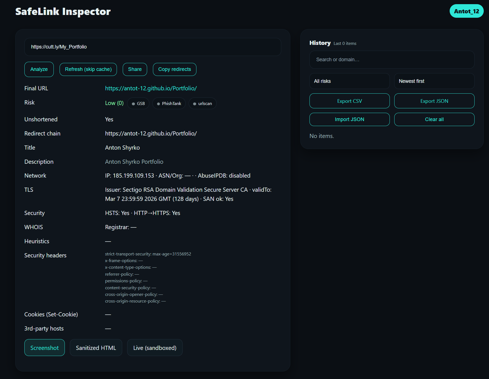
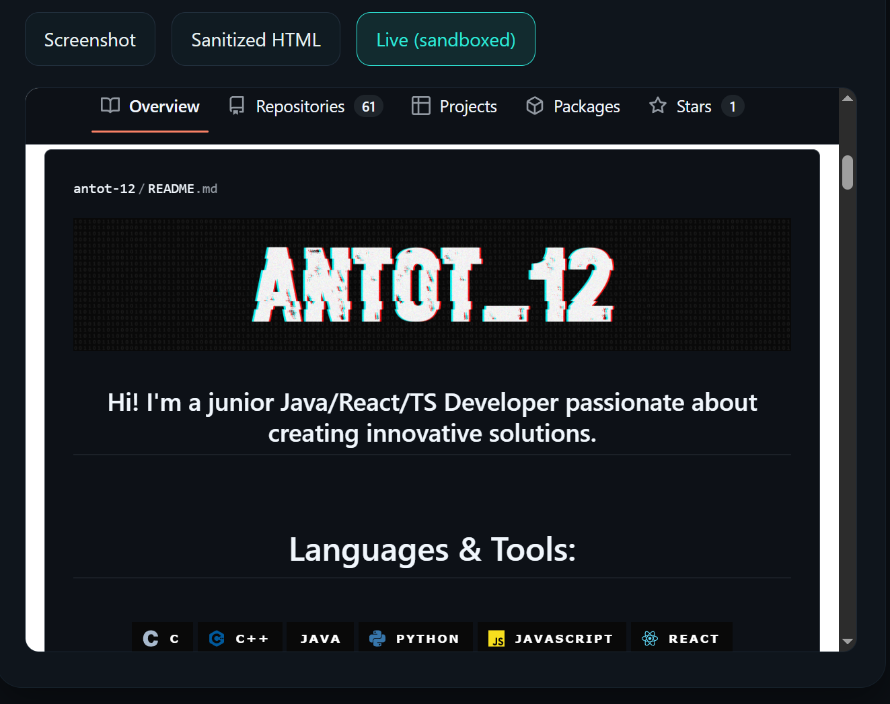

# SafeLink Inspector

A small web app that lets you paste any link and check it safely.
It unshortens redirects, looks at basic risk signals, shows TLS/WHOIS/security headers, parses forms, and lets you preview the page in a sandboxed viewer.

> Frontend: React (Vite)
> Backend: Node.js + Express

---

## Screenshots

### Analyzer


### Live sandbox viewer



---

## Features

* Paste a URL and analyze:

  * Unshorten redirect chain
  * Risk score + label
  * Reputation stubs (GSB, PhishTank, urlscan – off by default until you add keys)
  * TLS profile (issuer, expiry, SAN vs host)
  * WHOIS age (domain age in days)
  * Security headers + Set-Cookie flags (Secure/HttpOnly/SameSite)
  * Basic network info (IP/ASN/geo) via resolver
  * Form analysis (actions, cross-domain posts, sensitive fields)
  * HSTS + HTTP → HTTPS redirect indicator
  

* **Sanitized HTML**: stored server-side with strict CSP, previewed in an iframe


* **Live (sandboxed)**: separate origin proxy (`/live?url=...`) with CSP, frame-bust fixes, and asset rewriting


* **History**:

  * Search, filter by risk, sort (newest / by risk)
  * Re-analyze, open, view sanitized, share public page
  * Export CSV/JSON, import JSON
  * Clear all


* Keyboard shortcuts:

  * `/` focuses the URL input
  * `Ctrl+Enter` runs Analyze
  * In History: “Show in analyzer” scrolls to top

---

## Project structure

```
SafeLinkInspector/
├─ README.md
├─ .github/
│  └─ workflows/
│     └─ gh-pages.yml              
│
├─ app/                               # Frontend (React + Vite)
│  ├─ index.html
│  ├─ vite.config.js
│  ├─ package.json
│  ├─ .env.development                
│  ├─ .env.production                
│  ├─ styles.css
│  └─ src/
│     ├─ main.jsx
│     ├─ api.js
│     └─ components/
│        ├─ Analyzer.jsx
│        └─ History.jsx
│
├─ server/                            # Backend (Express)
│  ├─ package.json
│  ├─ vercel.json                     # Vercel config (serverless)
│  ├─ api/
│  │  └─ index.mjs                    # Vercel serverless entry (serverless-http)
│  └─ src/
│     ├─ index.mjs                    # Local dev entry (app.listen)
│     ├─ app.mjs                      # Express app factory 
│     ├─ liveServer.mjs               # Live sandbox proxy 
│     ├─ store/
│     │  └─ db.js
│     └─ analyzer/
│        ├─ forms.js
│        ├─ headers.js
│        ├─ netinfo.js
│        ├─ reputation.js
│        ├─ risk.js
│        ├─ sanitize.js
│        ├─ tls.js
│        ├─ unshorten.js
│        └─ whois.js
│
└─ docs/                             
   ├─ screenshot-analyzer.png
   └─ screenshot-live.png

```

---

## Requirements

* Node.js **20+** (works on Node 22 too)

---

## Quick start (local dev)

Open **two** terminals.

### Terminal 1 - backend

```powershell
cd server
npm install
npm run dev
```

* Default API URL: `http://localhost:4000`
* Health: `GET /api/health`

### Terminal 2 - live sandbox server

The live server is started automatically by the API (`startLiveServer()` in `index.mjs`).

Default live URL: `http://localhost:4080`

### Terminal 3 – frontend (React/Vite)

```powershell
cd app
npm install
# make sure app/.env points to live origin 
npm run dev
```

Vite will open: `http://localhost:5173`

---

## Environment variables

### app/.env

```
VITE_LIVE_ORIGIN=http://localhost:4080
```

### server/.env (optional)

```
PORT=4000
LIVE_PORT=4080
CACHE_TTL_MIN=15
```

If ports are busy, change them here and update `VITE_LIVE_ORIGIN` in the frontend.

---

## How to download from Git

### Clone

```bash
git clone https://github.com/Antot-12/SafeLinkInspector.git
cd SafeLinkInspector
```

---

## Development notes

### API endpoints (main)

* `POST /api/analyze`
  Body: `{ "url": "https://..." }`
  Returns: analysis object with finalUrl, risk, headers, tls, whois, forms, sanitized path, etc.

* `GET /api/history`
  Query: `q`, `risk` (`low|medium|high|all`), `sort` (`newest|risk`), `skip`, `limit`
  Returns: `{ items, total }`

* `GET /api/history/:id`

* `DELETE /api/history/:id`

* `DELETE /api/history` (clear all)

* `GET /api/history/export?fmt=csv|json`

* `POST /api/history/import` (body: a JSON array of records)

* `GET /api/sanitized/:id` (strict CSP view of the saved HTML)

### Live sandbox 

* `GET /live?url=...`
  Returns rewritten HTML:

  * removes site CSP/meta CSP and X-Frame headers
  * injects `<base href="...">`
  * neutralizes typical frame-busting (`top.location` → `window.location`, etc.)
  * rewrites `href/src/action` to `/asset?url=...`


* `GET /asset?url=...`
  Fetches assets through the live server

  * rewrites CSS `url(...)` to go via `/asset`
  * strips `Set-Cookie`
  * sends realistic User-Agent headers

### Why “Live (sandboxed)” can be blank

* Some pages require login or cookies to render.
  The live proxy **strips cookies by design** for safety, so private pages may stay blank.
* If the page uses heavy client protection, it can still block rendering inside iframes.

Tip: test public pages first. If you really need to debug with cookies, add a temporary flag in `liveServer.mjs` to allow them (unsafe for general use).

---

## Build for production

This is a simple local tool, but you can still build the frontend:

```bash
cd app
npm run build
# output in app/dist
```

Serve `app/dist` behind any static server or connect it to the API with a reverse proxy.

---

## Troubleshooting

* **Live is white**
  Check `VITE_LIVE_ORIGIN` points to the correct live server port.
  Try a different, public URL. Some sites need login or strict cookies.


* **Port in use**
  Change `PORT` and/or `LIVE_PORT` in `server/.env`.
  Change the frontend `VITE_LIVE_ORIGIN` accordingly.


* **CORS**
  Frontend runs on `5173` (or `5174`). The API’s CORS list includes those origins.

---

## Security model 

* Analyzer fetches target HTML on the server and saves a **sanitized** copy with very strict CSP.
* Live viewer runs on a different origin and rewrites the page to avoid dangerous behaviors in iframes.
* Cookies from target sites are not passed through to client.

---
